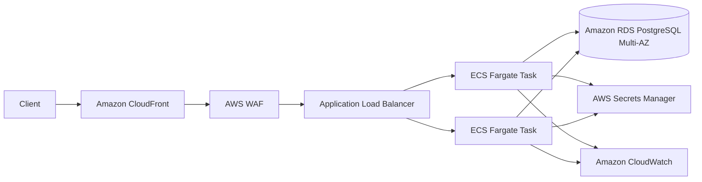
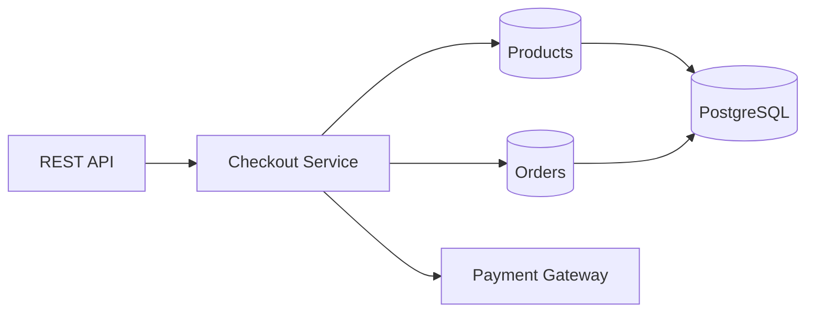

# Scalable AWS E-Commerce Platform

A production-grade **e-commerce platform prototype** built with **Java 21, Spring Boot 4, PostgreSQL, Docker, Terraform, and AWS-oriented infrastructure patterns**. The application focuses on one of the hardest parts of commerce systems—reliable checkout—while the infrastructure demonstrates how the service can be deployed as a highly available, horizontally scalable workload on AWS.

This is intentionally implemented as a **modular monolith** for the checkout consistency boundary. Orders and inventory share one PostgreSQL transaction, allowing the application to demonstrate strong consistency, idempotency, concurrency control, rollback behavior, and clean external-service boundaries without introducing unnecessary distributed transactions.

> **Project scope:** engineering portfolio/reference implementation. It demonstrates production-oriented architecture and implementation patterns, but it does not claim real customer traffic, PCI compliance, or unverified production benchmark numbers.

---

## Highlights

- Java 21 + Spring Boot 4 REST API
- PostgreSQL persistence with Flyway migrations
- Idempotent checkout using `Idempotency-Key`
- Pessimistic row locking for concurrent inventory updates
- Immutable order-line snapshots
- Transactional rollback on simulated payment failure
- Replaceable payment gateway abstraction
- Bean Validation and structured Problem Details responses
- Correlation IDs for request tracing
- Spring Boot Actuator health/readiness/liveness endpoints
- Prometheus metrics
- OpenAPI / Swagger UI
- Dockerized local environment
- Unit and PostgreSQL Testcontainers integration tests
- k6 checkout load-test scenario
- GitHub Actions CI
- CodeQL and Dependabot
- Terraform-based AWS infrastructure
- ECS Fargate, ALB, RDS Multi-AZ, CloudFront, WAF, Secrets Manager, and CloudWatch

---

## Architecture



### Application boundary



The application is stateless at the API layer and can be horizontally scaled behind the load balancer. Checkout and inventory remain in the same transactional boundary because they require strong consistency in this prototype.

---

## Checkout consistency model

A checkout request follows this flow:

1. The client sends a unique `Idempotency-Key`.
2. The application checks whether a committed order already exists for that key.
3. Requested product rows are acquired with database write locks.
4. Inventory availability is validated.
5. Inventory is reserved inside the current transaction.
6. Product SKU, name, price, and quantity are copied into immutable order-line snapshots.
7. The payment gateway attempts authorization.
8. A payment decline raises an exception and rolls the entire transaction back.
9. A successful order is committed and returned using its public UUID.

### Why idempotency matters

Clients can retry requests because of network timeouts, browser retries, gateway retries, or uncertain responses. Without idempotency, the same checkout could create multiple orders.

```text
Request 1
Idempotency-Key: checkout-123
        |
        v
Order A created

Request 2
Idempotency-Key: checkout-123
        |
        v
Order A returned
```

The second request does not create another order.

### Inventory race protection

Product rows are acquired with a pessimistic database lock before inventory is decremented. This protects the critical section when multiple checkout requests attempt to purchase the same inventory concurrently.

---

## Repository structure

```text
.
├── app/
│   ├── Dockerfile
│   ├── pom.xml
│   └── src/
│       ├── main/
│       │   ├── java/
│       │   └── resources/
│       │       └── db/migration/
│       └── test/
├── docs/
│   ├── architecture.md
│   └── runbook.md
├── infra/
│   └── terraform/
├── scripts/
│   └── demo.sh
├── tests/
│   └── load/
│       └── checkout.js
├── .github/
│   ├── workflows/
│   └── dependabot.yml
├── compose.yaml
└── README.md
```

---

## Local development

### Prerequisites

The fastest path only requires:

- Docker Desktop
- Docker Compose

For direct development outside Docker:

- Java 21
- Maven
- PostgreSQL 17

---

## Start the application

From the repository root:

```bash
docker compose up --build
```

The stack starts:

| Component | Address |
|---|---|
| Commerce API | `http://localhost:8080` |
| PostgreSQL | `localhost:5432` |
| Swagger UI | `http://localhost:8080/swagger-ui.html` |
| OpenAPI JSON | `http://localhost:8080/v3/api-docs` |
| Health | `http://localhost:8080/actuator/health` |
| Prometheus | `http://localhost:8080/actuator/prometheus` |

Verify application health:

```bash
curl http://localhost:8080/actuator/health
```

Expected:

```json
{"status":"UP"}
```

---

## Database migrations

Database schema management is handled by **Flyway**.

On first startup Flyway:

1. connects to PostgreSQL,
2. creates `flyway_schema_history`,
3. applies `V1__initial_schema.sql`,
4. and then Hibernate validates the resulting schema.

Hibernate is intentionally configured with:

```yaml
ddl-auto: validate
```

rather than automatically generating or updating the database schema. This keeps schema changes explicit and versioned.

---

## Product catalog

List products:

```bash
curl http://localhost:8080/api/products
```

The initial Flyway migration seeds demo products so the checkout flow can be tested immediately.

---

## Create an order

```bash
curl -i -X POST http://localhost:8080/api/orders \
  -H 'Content-Type: application/json' \
  -H 'Idempotency-Key: demo-checkout-001' \
  -d '{
    "customerEmail": "demo@example.com",
    "items": [
      {
        "productId": 1,
        "quantity": 2
      }
    ]
  }'
```

Repeat the exact request using the same `Idempotency-Key`.

The API should return the already committed order instead of creating another one.

---

## Simulate payment failure and rollback

The demo payment gateway intentionally declines addresses containing `decline`.

```bash
curl -i -X POST http://localhost:8080/api/orders \
  -H 'Content-Type: application/json' \
  -H 'Idempotency-Key: decline-demo-001' \
  -d '{
    "customerEmail": "decline@example.com",
    "items": [
      {
        "productId": 1,
        "quantity": 1
      }
    ]
  }'
```

Expected result:

```text
HTTP 409
```

Because the payment exception occurs inside the checkout transaction, the inventory update is rolled back as well.

---

## Demo script

A repeatable demo is included:

```bash
chmod +x scripts/demo.sh
./scripts/demo.sh
```

The script exercises:

- application health
- product retrieval
- successful checkout
- idempotent retry
- simulated payment decline
- transaction rollback behavior

A deeper walkthrough is available in:

```text
docs/runbook.md
```

---

## Automated tests

Run the Java test suite:

```bash
cd app
mvn verify
```

The project includes:

- service-level unit tests
- PostgreSQL Testcontainers integration testing
- database migration validation against PostgreSQL

Docker Desktop must be running for Testcontainers.

---

## Load testing

A k6 checkout scenario is available under:

```text
tests/load/checkout.js
```

Run:

```bash
k6 run tests/load/checkout.js
```

Any performance numbers should be interpreted together with the machine, concurrency level, database configuration, and test duration used to produce them.

---

## Observability

### Health

```bash
curl http://localhost:8080/actuator/health
```

### Prometheus metrics

```bash
curl http://localhost:8080/actuator/prometheus
```

### Correlation IDs

Requests can provide:

```text
X-Correlation-Id
```

The application propagates a correlation ID so individual requests can be traced through application logs.

---

## AWS infrastructure

Terraform under `infra/terraform/` models a production-oriented AWS deployment.

### Networking

- custom VPC
- two Availability Zones
- public load-balancer subnets
- private ECS/RDS subnets
- NAT gateway per AZ
- security-group isolation

### Compute

- ECS Fargate
- Application Load Balancer
- multiple service tasks
- CPU target-tracking Auto Scaling
- deployment rollback/circuit-breaker configuration

### Database

- Amazon RDS PostgreSQL
- Multi-AZ deployment
- encrypted storage
- automated backups
- private network placement
- generated database credentials

### Edge and security

- CloudFront
- AWS WAF
- AWS-managed common rule set
- IP-based rate limiting
- Secrets Manager

### Observability

- CloudWatch application logs
- ALB 5xx alarm
- infrastructure outputs for deployment integration

---

## Terraform validation

> **Cost warning:** `terraform apply` can create billable AWS resources including NAT gateways, ECS/Fargate, ALB, RDS Multi-AZ, CloudFront, and WAF.

For local validation:

```bash
cd infra/terraform

terraform fmt -check
terraform init -backend=false
terraform validate
```

For an actual environment, configure remote state first using:

```text
backend.hcl.example
```

and review a `terraform plan` before applying infrastructure.

---

## CI and security automation

The repository includes GitHub automation for:

- Maven verification
- Docker image build
- Terraform formatting/validation
- CodeQL analysis
- Dependabot dependency updates

Infrastructure is deliberately **not automatically applied** from pull requests.

---

## Security boundaries

Implemented in this prototype:

- private database placement
- Secrets Manager integration
- non-root application container
- WAF managed rules
- rate limiting at the edge
- HTTPS viewer policy
- input validation
- controlled API errors
- static security scanning
- automated dependency update checks

A real commercial commerce deployment would additionally require:

- external identity/OIDC provider
- PCI-compliant payment processing
- application-specific IAM roles with least privilege
- end-to-end TLS to the origin
- distributed tracing
- SLOs and alerting policies
- formal backup/disaster-recovery procedures
- secret rotation
- production penetration/security testing

---

## Engineering decisions

### Why a modular monolith?

The checkout and inventory workflow benefits from a strong transactional boundary. Introducing independent inventory/order services would require distributed consistency mechanisms that are unnecessary for the core goal of this prototype.

The API itself remains stateless, so horizontal scaling is still possible at the compute layer.

### Why pessimistic locking?

Inventory is a shared mutable resource. Locking the relevant product rows makes the critical checkout section explicit and prevents multiple transactions from independently validating and decrementing the same stock.

### Why immutable order-line snapshots?

Product metadata changes over time. Historical orders should preserve the product name, SKU, and price that existed when the purchase was made.

### Why abstract the payment gateway?

The checkout domain should not depend directly on one payment vendor. `PaymentGateway` provides a boundary that can later be implemented using a real provider without rewriting the order workflow.

---

## Possible next steps

Potential extensions include:

- OIDC/Cognito authentication
- shopping cart persistence
- asynchronous payment workflow
- transactional outbox for post-order events
- email/order notifications
- OpenTelemetry distributed tracing
- Grafana dashboards
- ECR deployment pipeline
- blue/green ECS deployment
- synthetic monitoring
- Redis-backed catalog caching

---

## Demo talking points

When presenting the project, useful areas to discuss are:

1. Why checkout and inventory share one transaction.
2. How `Idempotency-Key` prevents duplicate orders.
3. How row locking handles concurrent inventory updates.
4. Why product details are snapshotted into order lines.
5. Why payment is isolated behind an interface.
6. Why Flyway owns schema changes while Hibernate only validates.
7. How ECS and ALB enable horizontal scaling.
8. Why RDS is placed in private subnets.
9. Where CloudFront and WAF sit in the request path.
10. What would need to change before supporting real payments or customers.

More details:

- [`docs/architecture.md`](docs/architecture.md)
- [`docs/runbook.md`](docs/runbook.md)

---

## License

MIT
